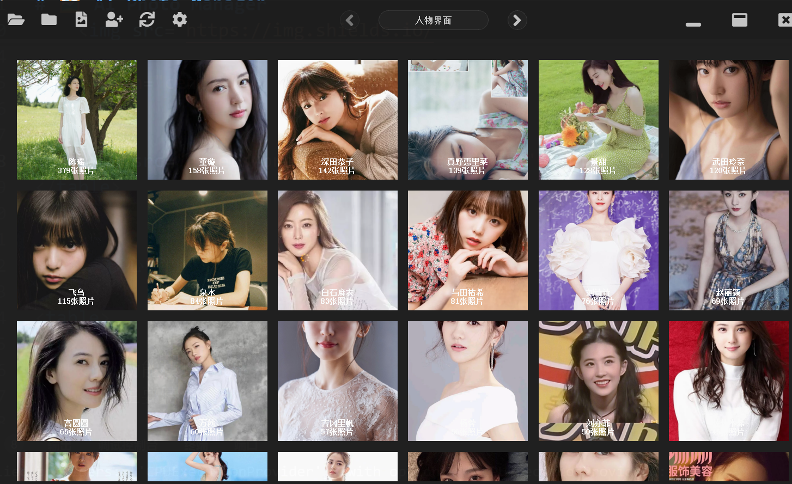

# 🖼️ AI Photo Manager

<div align="center">


<p align="center">
    
    
    
    <br>
    
    
    
</p>

> 一个基于AI的智能照片管理工具，支持人脸识别、相似人脸自动聚类和nsfw检测

[English](./README_EN.md) | 简体中文 | [日本語](./README_JP.md)

</div>

## 📸 界面预览

<div align="center">
<table>

<td></td>
</table>
</div>

## ✨ 核心特性

<table>
<tr>
    <th>功能模块</th>
    <th>主要特性</th>
</tr>
<tr>
    <td>人脸识别</td>
    <td>
        • 自动检测和识别人脸<br>
        • 支持人脸注册和命名<br>
        • 按人名自动归类照片<br>
        • 支持批量处理
    </td>
</tr>
<tr>
    <td>智能聚类</td>
    <td>
        • 自动对未识别人脸聚类<br>
        • 支持相似度阈值调整<br>
        • 可视化聚类结果<br>
        • 支持批量重命名
    </td>
</tr>
<tr>
    <td>nwsf检查</td>
    <td>
        • AI智能内容检测<br>
        • 多种检测类别<br>
        • 自定义检测阈值<br>
        • 批量扫描支持
    </td>
</tr>
<tr>
    <td>文件管理</td>
    <td>
        • 重复照片检测<br>
        • 文件夹监控<br>
        • 拖拽操作支持<br>
        • 多种视图模式
    </td>
</tr>
</table>

## 📝 目录
- [功能特性](#-功能特性)
- [环境配置](#-环境配置)
- [使用指南](#-使用指南)
- [开发问题](#-开发问题)
- [待办事项](#-待办事项)
- [贡献指南](#-贡献指南)
- [开源协议](#-开源协议)


## ✨ 主要功能

### 1. 人脸识别与管理
- 自动检测和识别照片中的人脸
- 支持人脸注册和命名
- 按人名自动归类照片
- 支持批量处理和实时预览

### 2. 智能聚类
- 自动对未识别的人脸进行聚类
- 支持相似度阈值调整
- 可视化聚类结果
- 支持批量重命名

### 3. nsfw
- 基于AI的nsfw分类
- 支持多种检测类别
- 可自定义检测阈值
- 支持批量扫描

### 4. 文件管理
- 重复照片检测
- 文件夹监控
- 支持拖拽操作
- 多种视图模式

## 🛠️ 安装与配置

### 环境要求
```bash
Python 3.8+
CUDA 11.0+ (推荐)
```

### 安装依赖
```bash
pip install -r requirements.txt
```

### 模型配置

#### 1. InsightFace 模型
```bash
https://github.com/deepinsight/insightface/releases/download/v0.7/buffalo_l.zip
```
解压到 model 目录
```bash
unzip buffalo_l.zip -d model/
```


#### 2. NudeNet 模型
```bash
wget https://github.com/notAI-tech/NudeNet/releases/download/v0/detector_v2_default_checkpoint.onnx
```
移动到指定目录
```bash
mv detector_v2_default_checkpoint.onnx model/640m.onnx
```

## 💡 使用指南

### 基本操作
1. **启动程序**
   ```bash
   python photo_manager.py
   ```

2. **添加照片**
   - 点击"添加文件"或"添加文件夹"
   - 支持拖拽添加
   - 支持批量导入

3. **人脸识别**
   - 自动检测新添加照片中的人脸
   - 右键点击可进行人脸注册
   - 支持修改已识别的人名

4. **智能聚类**
   - 在"未识别"页面点击"聚类分析"
   - 调整相似度阈值（默认0.3）
   - 查看聚类结果并进行批量处理

5. **内容审核**
   - 在设置中开启内容审核
   - 自定义审核类别和阈值
   - 查看审核结果

### 高级功能
- **自定义配置**：修改 `config.json` 调整参数
- **批量处理**：支持批量导入、批量处理
- **快捷键支持**：常用操作都有对应快捷键

## 🔧 开发问题与解决方案

### 1. 人脸识别准确性
**问题**：初始版本识别准确率不高
**解决**：
- 使用 InsightFace 的最新模型
- 增加人脸质量检测
- 优化特征提取流程

### 2. 性能优化
**问题**：处理大量照片时性能下降
**解决**：
- 实现异步加载
- 使用多线程处理
- 优化缓存机制
- 添加进度反馈

### 3. 内存管理
**问题**：处理高清图片时内存占用过高
**解决**：
- 实现图片延迟加载
- 优化缩略图生成
- 及时释放不需要的资源

### 4. UI响应性
**问题**：界面在处理时卡顿
**解决**：
- 使用QThread处理耗时操作
- 实现平滑动画效果
- 优化事件处理机制

## 📝 待办事项


- [ ] 支持视频处理
- [ ] 增加图片多选
- [ ] 增加图片批量删除
- [ ] 增加图片批量重命名
- [ ] 增加图片批量移动
- [ ] 增加图片批量复制
- [ ] 增加图片批量删除
- [ ] 增加数据库支持
- [ ] 增加排序功能
- [ ] 增加搜索功能
- [ ] 增加刷选功能
- [ ] bug解决

## 🤝 贡献指南

欢迎提交 Issue 和 Pull Request！

## 📄 开源协议

本项目采用 MIT 协议开源。

```